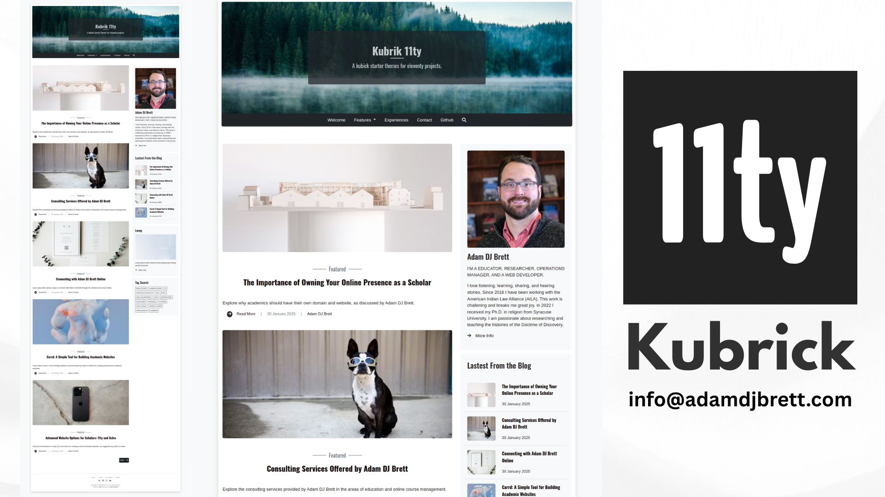

# 11ty-shining-kubrick

A theme based off the iconic Kubrick Theme for WP. This port is named after the 11th film directed by Kubrick, *The Shining*.

Need help?? Or do you have a project to develop with me?

Website : https://adamdjbrett.com

Email : info@adamdjbrett.com

---

### Info

+ Developer : [Adam DJ Brett](https://www.adamdjbrett.com)
+ Website : https://www.adamdjbrett.com
+ Email: info@adamdjbrett.com

---

### Change Log:

#### 08 April 2025

+ Fix duplicate id categories
+ Install Markdown It
+ Add footernotes
+ Add Table of Content

---

### Featured:

+ 11ty Aka Eleventy
+ Bootstrap CSS
+ Static Page
+ YAML Configuration
+ Mardown Content
+ Blog List
+ Blog Pagination
+ Blog Posts Article
+ Posts Pagination
+ Auto SEO ready
+ Pagefind Search
+ Footernotes
+ Table Of Content
+ **New** Categories implementation inspired by jekyll
+ Clean Minimalist Design
+ Activate / Deactivate Widget Setup

---

### Docs

+ Setup and Update widget on `_data/metadata.yaml`
+ Change Navbar on `navbar area`
+ Update Author on `author area`
+ Activate / Deactivate and setup widget on widget area change show widget `true` or `false`
+ Featured Post - add tag featured on your article post tags `content/blog/*.md`
+ Categories - insert on category markdown post `content/blog/*.md`

